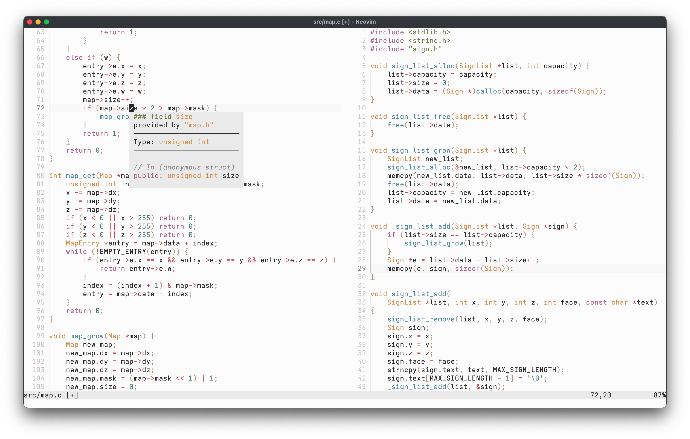
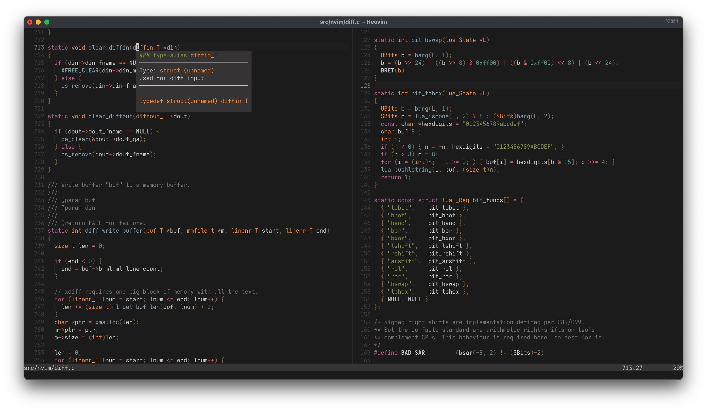

# lavish.nvim

A sleek, customizable Neovim colorscheme

 

> [!NOTE] lavish.nvim is a work in progress. While the configuration format is 100% stable there may be slight changes to both the colors and their use throughout the theme.

## Installation

You can install lavish.nvim manually or using your plugin manager of choice. All that matters is that it gets placed in a directory where Neovim can find it (view `:help runtimepath` inside Neovim for such locations). Two examples are given below.

**Manual installation using `git`:**

```sh
mkdir -p "${XDG_DATA_HOME:-$HOME/.local/share}/nvim/site/pack/lavish/start" && \
git clone https://github.com/ferdinandrau/lavish.nvim \
"${XDG_DATA_HOME:-$HOME/.local/share}/nvim/site/pack/lavish/start/lavish.nvim"
```

**Installation (and use) with [lazy.nvim](https://github.com/folke/lazy.nvim):**

```lua
{
    'ferdinandrau/lavish.nvim',
    priority = 1000,
    config = function()
        require('lavish').apply()
    end
}
```

## Applying

lavish.nvim registers three colorschemes for you to choose:

- `lavish` respects Neovim's `background` option, changing between light and dark to match it. To apply it, use

  ```lua
  require('lavish').apply()
  -- or equivalently
  vim.cmd.colorscheme('lavish')
  ```

- `lavish-light` always shows the light variant, irrespective of `background`. To apply it, use

  ```lua
  require('lavish').apply('light')
  -- or equivalently
  vim.cmd.colorscheme('lavish-light')
  ```

- `lavish-dark` always shows the dark variant, irrespective of `background`. To apply it, use

  ```lua
  require('lavish').apply('dark')
  -- or equivalently
  vim.cmd.colorscheme('lavish-dark')
  ```

## Configuration

The `lavish` Lua module provides a function called `setup` to customize aspects of the plugin, including colors and highlights. It does not have to be called if you are happy with the defaults (see below).

**Here's an example:**

```lua
require("lavish").setup({
    style = {
        italic_comments = true,
        italic_strings = true,
    },
    palette_overrides = {
        dark = {
            bg1 = "#000000",
            bg2 = "#121212",
        },
    },
})
```

**Default values:**

```lua
{
    -- The variant of the theme ('light' or 'dark') to use
    -- when the dynamic version is applied and the `background`
    -- option is, for some weird reason, unset.
    fallback_background = 'light',

    style = {
        -- Whether to show a solid background or not. If set to
        -- `true`, the underlying GUI's background shows, which is
        -- usually needed for a transparency effect.
        transparent = false,

        -- Whether or not comments show be italicized.
        italic_comments = false,

        -- Whether or not strings show be italicized.
        italic_strings = false,
    },

    -- Color customizations. You can override existing colors and
    -- define new ones. To see the table's expected structure, take
    -- a look at `DEFAULT_PALETTE` inside `lua/lavish/palette.lua`.
    palette_overrides = {},

    -- Highlight customizations. Setting this to a custom function
    -- that will receive colors and the above `style` table allows
    -- you to return a table containing key-value pairs that
    -- specify highlights. `colors` is the `light` or `dark` table
    -- of the palette. The keys of the returned table should be
    -- highlight group names, the values option tables as would be
    -- passed to `nvim_set_hl`.
    -- See `fill_default` inside `lua/lavish/scheme.lua` for the
    -- default mapping and below for an example.
    scheme_overrides = function(colors, style)
        return {}
    end,
}
```

**Example usage of `scheme_overrides`:**

```lua
require("lavish").setup({
    scheme_overrides = function(colors, style)
        return {
            Operator = { fg = colors.normal.magenta },
            Keyword = { fg = colors.normal.green, italic = true },
            Normal = { bg = style.transparent and "NONE" or colors.base.bg2 },
            NormalFloat = { bg = colors.base.bg3 },
            Search = { fg = colors.base.fg1, bg = colors.dim.red },
            WinBar = { link = "Normal" },
        }
    end,
})
```
